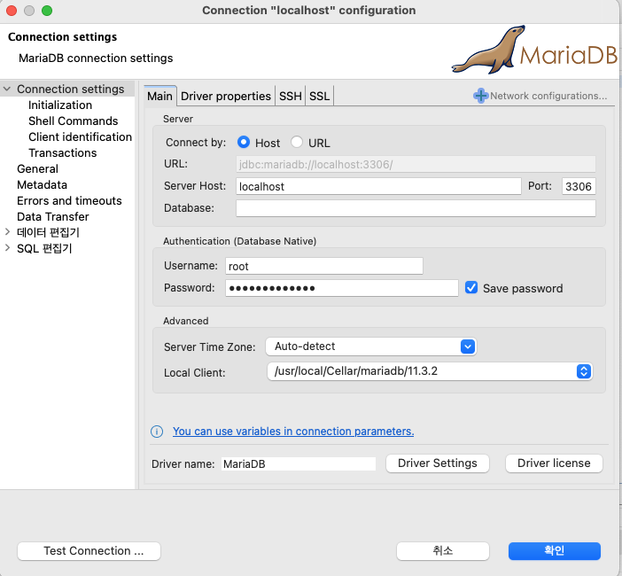

# 코드로 배우는 스프링부트 웹 프로젝트
### [Git 링크](https://github.com/Zero-Kang?tab=repositories)
### [Cafe 링크](https://cafe.naver.com/gugucoding)

## 34p

- HeidiSQL을 사용하지 않고 DBeaver를 사용하고자 하는 경우 아래와 같이 등록
- root 유저 연결

  

- root 연결의 Databases에서 Create New Database 후 bootex 생성

  

- root 연결의 Users에서 Create New User
  이후 bootex에 대한 권한만 주고 bootuser 생성

  

  

  

- bootex 에 대해 bootuser로 연결

  

## 42p

- 본인 프로젝트의 스프링부트 버전에 따라 검색
    - build.gradle에서 spring 버전 확인 가능
    - springboot 3.2.5에서 2.7.0 테스트 시 오류는 없었음

## 83p

- 그림 3-2,3 종속성
    - Spring Boot DevTools
    - Lombok
    - Spring Web
    - Thymeleaf

## 103p

- Thymeleaf 3.1버전 이상부터 java8time이 포함되어, 따로 의존성 추가할 필요 없음
  (Thymeleaf 버전 확인은 External Libraries에서 thymeleaf 찾기)